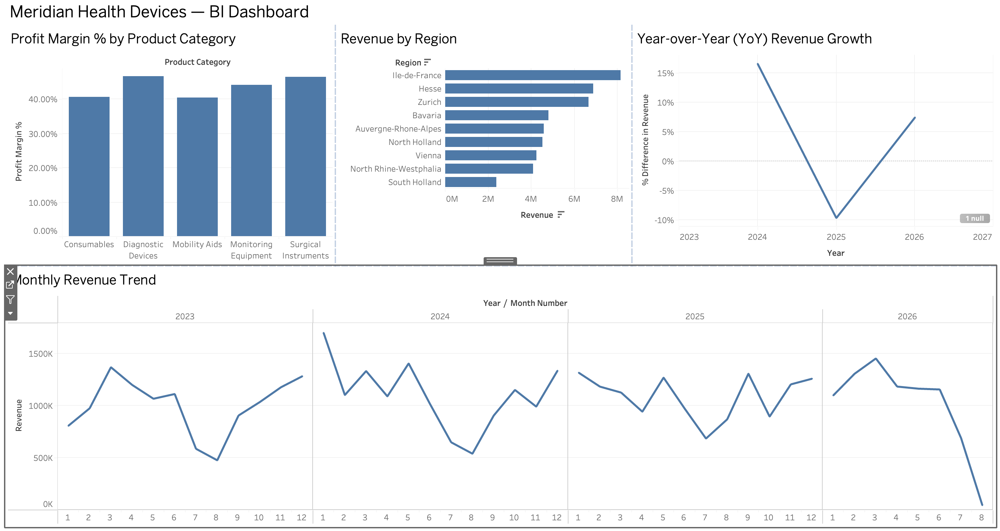

# Meridian Health Devices — Sales BI Dashboard

A self-directed portfolio project simulating a real BI Analyst engagement at a MedTech company: designing a star schema, generating realistic synthetic sales data, building an interactive Tableau dashboard, and automating weekly data refresh — end to end, from raw requirements to a working, documented pipeline.

> **Why "Meridian Health Devices"?** This is a fictional company, built specifically to avoid any conflict with proprietary employer data. The business scenario, schema, and numbers are all synthetic, but the modeling decisions and BI techniques are the same ones used in real MedTech sales reporting.

---

## The business problem

Meridian Health Devices sells medical imaging, monitoring, diagnostic, and consumable products to hospitals across Germany. Sales leadership needs a single source of truth to answer:

- Which regions and product categories are driving revenue and profit?
- How is revenue trending month-over-month and year-over-year?
- Which hospitals and sales reps are top performers?
- Where are the anomalies — unexpected spikes or dips — worth investigating?

This project builds that reporting layer from scratch: schema design → synthetic data → dashboard → automation.

---

## Tech stack

| Layer | Tool | Notes |
|---|---|---|
| Data modeling | Star schema (hand-designed) | See `docs/schema.md` |
| Synthetic data generation | Python (Faker, pandas) | `scripts/generate_meridian_data.py` |
| Query practice | MySQL | Window functions, CTEs, cohort/churn analysis — see `docs/` |
| Visualization | Tableau Public | Power BI Desktop isn't available on macOS Apple Silicon without significant workaround cost; Tableau Public was the pragmatic substitute — same star-schema/calculated-field concepts apply directly |
| AI integration | Anthropic API (Claude) | `scripts/ai_insights.py` — generates a plain-English KPI summary from the data |
| Automation | GitHub Actions | `.github/workflows/refresh_data.yml` — scheduled weekly data regeneration |

---

## Data model

A star schema with `FactSales` at the center and four dimension tables:

- **`FactSales`** — grain: one row per product-line within a transaction
- **`DimDate`** — calendar table with weekday/weekend/holiday flags, fiscal year
- **`DimProduct`** — device/consumable catalog with category, list price, unit cost
- **`DimHospital`** — customer hospitals with region, type, organization size
- **`DimSalesRep`** — sales reps with region and tenure

Full design rationale (why this grain, why a separate date table, why certain fields were deliberately excluded) is documented in [`docs/schema.md`](docs/schema.md).

---

## Dashboard

Four linked views in a single Tableau dashboard:

1. **Profit Margin % by Product Category**
2. **Year-over-Year Revenue Growth**
3. **Revenue by Region**
4. **Monthly Revenue Trend** (full-width, spans all years)

Clicking a region bar filters the other three charts — a working filter action, not just static charts.



---

## SQL practice

Before building the pipeline, I worked through an extensive multi-dataset SQL practice set covering the patterns most commonly tested in BI Analyst interviews: window functions (`RANK`, `ROW_NUMBER`, `LAG`/`LEAD`, running totals with explicit frame clauses), recursive CTEs for hierarchy traversal and date-spine generation, anti-joins, calendar-spine joins for monthly active metrics, cohort retention, churn detection, and conditional-aggregation pivoting. Practice files and question sets are in the repo for reference.

---

## AI integration

Two things worth being transparent about here, since honesty about scope is itself a signal of good judgment:

- **Tableau's Explain Data** (built-in AI-assisted anomaly explanation) is a Creator-tier feature and isn't available in the free Tableau Public edition used for this project. I confirmed this directly rather than working around it.
- Instead, I built [`scripts/ai_insights.py`](scripts/ai_insights.py): a documented, from-scratch pipeline that calculates KPIs with pandas (same logic as the Tableau calculated fields and SQL queries — just a different tool) and sends them to Claude's API to generate a short, plain-English executive summary. The AI is used strictly as a writing layer on top of numbers I already calculated and trust — not as a calculator. The script is fully commented and ready to run with an API key.

---

## Automation

[`refresh_data.yml`](.github/workflows/refresh_data.yml) is a GitHub Actions workflow that regenerates the synthetic dataset weekly (Monday 6am UTC) and commits the result — simulating new sales data arriving on a schedule without manual intervention. It also supports manual triggering via `workflow_dispatch`. The data generation script deliberately has no fixed random seed, so each run produces genuinely different numbers rather than repeating the same data.

---

## What I'd do with real Azure infrastructure

This project simulates the target stack (Power BI, Azure Synapse, DAX) using accessible substitutes given local environment constraints. With production Azure access, the natural next steps would be:

- Land the synthetic CSVs in **Azure Data Lake Gen2** instead of a GitHub-committed folder
- Model the star schema in **Azure Synapse Analytics** instead of flat CSVs
- Rebuild the calculated fields as **DAX measures** in Power BI Desktop/Service
- Replace the GitHub Actions refresh with a **Synapse pipeline** on a schedule

---

## Talking points (STAR format, for interviews)

*(Fill in with your own words once you've built the project — a few starting angles below.)*

- **Situation/Task:** Needed a portfolio project demonstrating BI Analyst skills for a MedTech-specific role, without direct professional BI experience or Power BI access on my hardware.
- **Action:** Designed a star schema from first principles, generated realistic synthetic data with deliberate seasonality/anomalies/messiness, built an interactive Tableau dashboard, and automated the data refresh with GitHub Actions.
- **Result:** A fully working, publicly documented pipeline — plus hands-on practice with the exact SQL patterns (window functions, CTEs, cohort analysis) that come up in BI interviews.

---

## Repo structure

```
data/        synthetic CSVs (FactSales, DimDate, DimProduct, DimHospital, DimSalesRep)
docs/        schema design doc, SQL practice questions, screenshots
powerbi/     (reserved — see note on Power BI vs. Tableau above)
scripts/     data generation + AI insights scripts
.github/     GitHub Actions workflow for automated weekly refresh
```

## AI tools used

Built with assistance from Claude (Anthropic) for planning, debugging, and code review throughout — documented here transparently rather than presented as entirely unassisted work.
