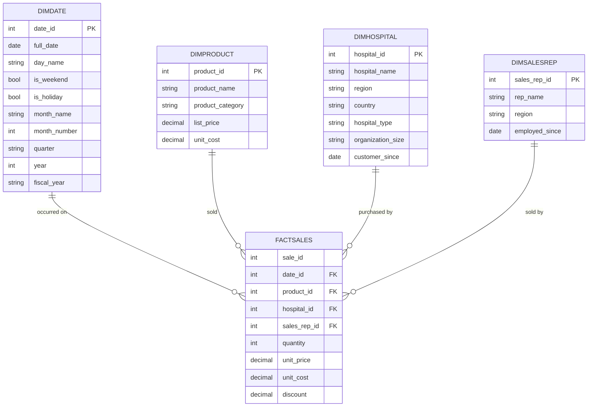

# Meridian Health Devices — Star Schema

## Design decisions

- **Grain of `FactSales`:** one row per product-line within a transaction (not one row per whole order). This mirrors real order/order-item structures and lets the model answer product-level questions ("top 5 products by revenue") that a transaction-grain table couldn't.
- **`DimDate` as a separate table**, rather than storing raw dates in `FactSales`: this is standard BI/semantic-model practice, and it pre-computes fields (is_weekend, quarter, fiscal_year) that would otherwise need to be recalculated in every query or DAX/calculated-field measure.
- **`DimProduct.list_price` vs. `FactSales.unit_price`:** deliberately kept separate. `list_price` is the catalog/reference price; `unit_price` is what was actually charged on a given sale (which may differ due to discounts or negotiated deals). Collapsing these into one field would make it impossible to analyze discounting behavior.
- **No sensitive HR data in `DimSalesRep`:** age and salary were deliberately excluded. A sales-performance semantic model doesn't need them, and including sensitive personal data without a clear business justification is a data-governance red flag.

## Entity-relationship diagram

## Table reference

### FactSales
Grain: one row per product-line within a sales transaction.

| Column | Type | Notes |
|---|---|---|
| sale_id | int | Groups multiple product-lines belonging to the same transaction |
| date_id | int (FK) | → DimDate |
| product_id | int (FK) | → DimProduct |
| hospital_id | int (FK) | → DimHospital |
| sales_rep_id | int (FK) | → DimSalesRep |
| quantity | int | |
| unit_price | decimal | Actual price charged on this sale (post-discount logic applied at query time) |
| unit_cost | decimal | Cost to Meridian at time of sale |
| discount | decimal | e.g. 0.10 = 10% off |

### DimDate
| Column | Notes |
|---|---|
| date_id (PK) | |
| full_date | |
| day_name | 'Monday', 'Tuesday', etc. |
| is_weekend | |
| is_holiday | |
| month_name / month_number | month_number avoids alphabetical-sort bugs when ordering chronologically |
| quarter | 'Q1'–'Q4' |
| year | |
| fiscal_year | Assumption: matches calendar year unless stated otherwise |

### DimProduct
| Column | Notes |
|---|---|
| product_id (PK) | |
| product_name | e.g. "ScanPro X200" |
| product_category | e.g. "Diagnostic Devices" |
| list_price | Catalog price — distinct from FactSales.unit_price |
| unit_cost | Enables margin calculations |

### DimHospital
| Column | Notes |
|---|---|
| hospital_id (PK) | |
| hospital_name | |
| region | |
| country | |
| hospital_type | e.g. Private Clinic, University Hospital, Public Hospital Network |
| organization_size | e.g. Small / Medium / Large |
| customer_since | First purchase date — supports new vs. long-term customer analysis |

### DimSalesRep
| Column | Notes |
|---|---|
| sales_rep_id (PK) | |
| rep_name | |
| region | Combined home base / assigned selling region |
| employed_since | |
